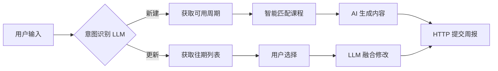

<div align="center">

# 🤖 蓝桥周报智能助手

### 一句话写周报，告别手动填表

[](https://dify.ai/)
[](./LICENSE)
[](.)

</div>

---

## ✨ 为什么用它？

> 😫 **以前**：打开蓝桥 → 点周报 → 选周期 → 选课程 → 填总结 → 填问题 → 填方案 → 填计划 → 提交  
> 🚀 **现在**：发一句 **"新建周报，这周学了 Java 多线程"** → 搞定！

| 痛点 | 解决方案 |
|------|----------|
| 每周重复填写 | 🔥 **极速模式**：一句话自动生成全部内容 |
| 忘记提交 | 📅 自动匹配当前周期，绝不遗漏 |
| 课程选择繁琐 | 🎯 根据学习内容智能匹配课程 |
| 修改往期麻烦 | 📝 直接说"更新周报"，选择后自然语言修改 |

---

## 🎯 核心功能

```
🗣️ "新建周报，本周学了 Java 的多线程和 IO 流"
   ↓
🔐 自动登录蓝桥账号
   ↓
📅 检测可用周期（只有一个自动选定）
   ↓
📚 智能匹配关联课程
   ↓
🤖 AI 生成周报四大板块
   ↓
✅ 自动提交到蓝桥平台
```

---

## 📦 文件说明

| 文件 | 说明 |
|------|------|
| `lanqiao-weekly-agent.yml` | Dify 工作流配置（DSL 格式），导入即用 |

---

## 🚀 快速开始

### Step 1: 导入工作流

1. 登录 [Dify Cloud](https://cloud.dify.ai/) 或自部署 Dify
2. 工作室 → **导入 DSL 文件**
3. 上传 `lanqiao-weekly-agent.yml`

### Step 2: 配置模型

- 工作流使用 **通义千问**（`qwen-flash` / `qwen3-max`）
- 在 Dify 模型设置中添加 OpenAI 兼容模型或直接配置通义

### Step 3: 配置知识库（重要）

工作流中包含一个 **知识库检索节点**，用于根据用户输入的学习内容智能匹配相关知识点。

1. 在 Dify 中创建一个知识库
2. 上传你的学习资料文档（课程讲义、笔记等）
3. 在工作流的「知识检索」节点中绑定你创建的知识库

> 💡 **提示**：知识库内容越丰富，AI 生成的周报内容越详细准确。如果不配置，该节点会跳过，仍可正常使用基础功能。

### Step 4: 开始使用

在对话框输入你的 **蓝桥账号** 和 **密码**，然后：

```
👉 "新建周报，这周学了 Linux 和 Shell 脚本"
👉 "更新周报"
```

---

## 💬 支持的指令

| 指令类型 | 示例 | 效果 |
|----------|------|------|
| ⚡ **极速新建** | `新建周报，本周学了 Java` | 全自动，一步到位 |
| 📝 **普通新建** | `新建周报` | 引导式，逐步确认 |
| 🔄 **更新往期** | `更新周报` | 列出已提交记录，选择后修改 |

---

## ⚙️ 技术架构



---

## ⚠️ 注意事项

- 🏫 本版本针对 **东科蓝桥** 配置，其他学校需修改 `saas-slug` 参数
- 🔒 账号密码仅用于登录获取 Cookie，不存储于任何地方
- 📡 需要网络环境能正常访问蓝桥平台 API

---

## 📄 License

[MIT](./LICENSE) © 2025 Gankup

---

<div align="center">

**如果觉得有用，请给个 ⭐ Star！**

</div>
